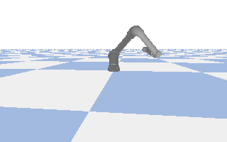
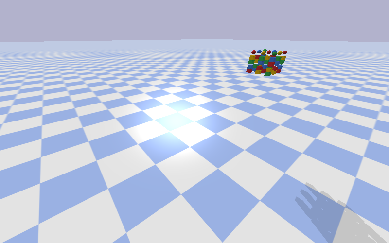

# pybullet-works
This repo is about to understand pybullet in a detailed way and integrate with ROS.

# Free Drive Notebook 
This notebook gives a basic intro to load a URDF and see a basic simulation. 

# Adding Collision Objects

Code: 
